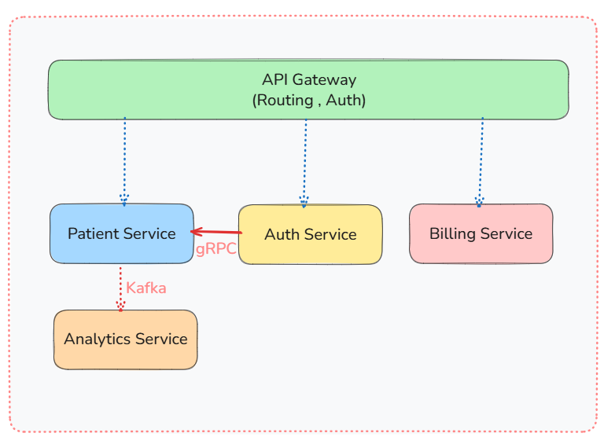
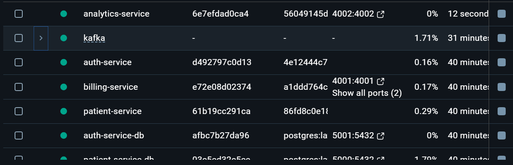
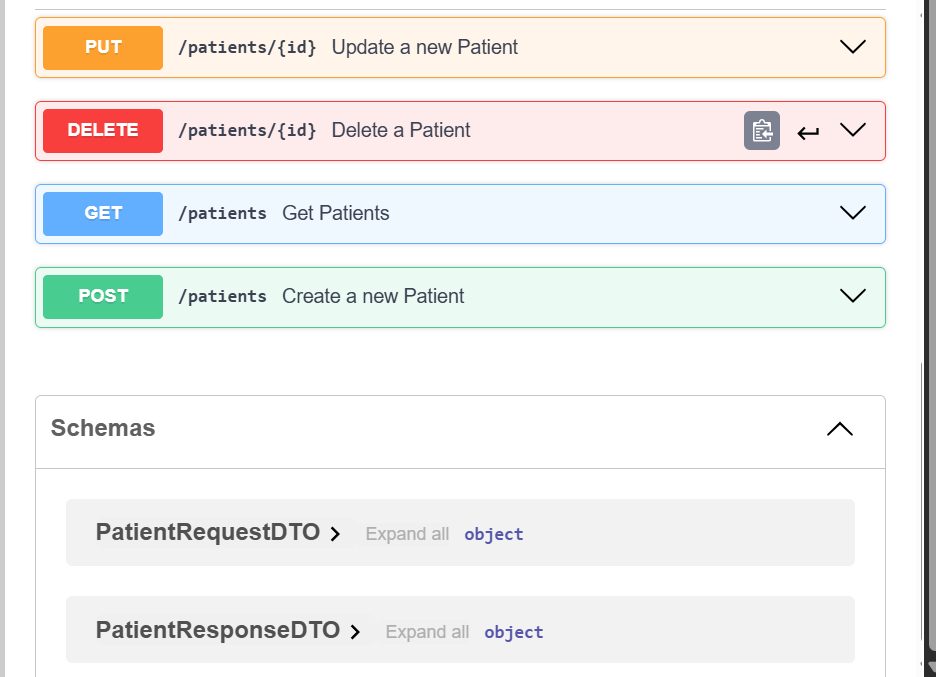
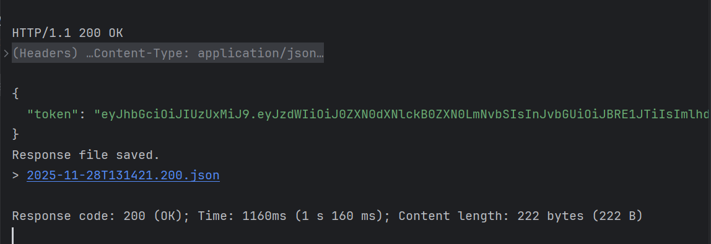
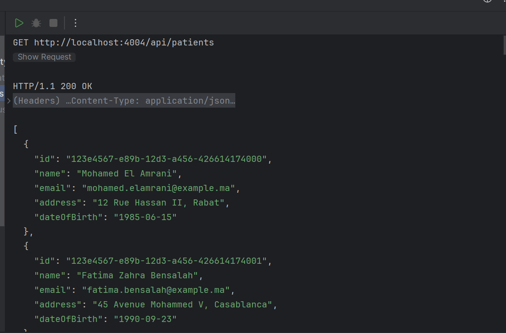

# 🏥 Hospital Management Microservices System

[](https://spring.io/projects/spring-boot)
[](https://www.oracle.com/java/)
[](https://www.docker.com/)
[](https://grpc.io/)
[](https://kafka.apache.org/)


This project demonstrates a full microservices solution tailored for a hospital scenario, focusing on the decoupling of major operations such as patient management, billing, analytics, authentication, inter-service communications, and API gateways. It leverages Spring Boot for service implementations, Docker for containerization, and modern communication technologies, and JWT-based authentication.

---

## 📋 Table of Contents

- [Overview](#overview)
- [Key Features](#key-features)
- [Architecture](#architecture)
- [Technology Stack](#technology-stack)
- [Microservices](#microservices)
- [Getting Started](#getting-started)
- [API Documentation](#api-documentation)
- [Testing](#testing)
- [Development Timeline](#development-timeline)
- [Contributing](#contributing)
- [License](#license)

---

## 🎯 Overview

This project showcases a complete microservices ecosystem designed for hospital operations, built to demonstrate proficiency in modern backend development practices. The system handles patient management, billing operations, real-time analytics, and secure authentication through independently deployable services that communicate via REST APIs, gRPC, and event streaming.

**Perfect for demonstrating:**
- Microservices architecture design and implementation
- Inter-service communication patterns (REST, gRPC, Kafka)
- Container orchestration with Docker
- API Gateway pattern with authentication
- Event-driven architecture
- Production-ready Spring Boot applications

---

## ✨ Key Features

- **🔐 Secure Authentication**: JWT-based authentication with role-based access control
- **👥 Patient Management**: Complete CRUD operations with validation and error handling
- **💰 Billing Integration**: gRPC-based high-performance billing service communication
- **📊 Real-time Analytics**: Event-driven analytics using Apache Kafka
- **🚪 API Gateway**: Centralized routing, authentication, and request aggregation
- **📝 API Documentation**: Auto-generated OpenAPI/Swagger documentation
- **🐳 Containerized**: Full Docker support for all services
- **🧪 Comprehensive Testing**: Integration tests covering all critical flows
- **🔄 Event Streaming**: Kafka-based patient event processing for analytics

---

## 🏗️ Architecture

The system follows a microservices architecture with the following components:





### Architecture Highlights

**Communication Patterns:**
- **REST APIs**: Client-facing endpoints via API Gateway
- **gRPC**: High-performance synchronous communication between Patient and Billing services
- **Apache Kafka**: Asynchronous event streaming for analytics

**Design Principles:**
- **Separation of Concerns**: Each service owns its domain and data
- **Independent Deployability**: Services can be deployed independently
- **Resilience**: Failure isolation and graceful degradation
- **Scalability**: Horizontal scaling capability for each service
- **Security**: Centralized authentication with JWT token validation

---

## 🛠️ Technology Stack

| Category | Technologies |
|----------|-------------|
| **Backend Framework** | Spring Boot 3.x, Spring Web, Spring Data JPA |
| **Build Tool** | Maven |
| **Programming Language** | Java 17+ |
| **Databases** | PostgreSQL (Production), H2 (Development/Testing) |
| **Communication** | gRPC, Protocol Buffers, REST APIs |
| **Event Streaming** | Apache Kafka, Kafka Producer/Consumer APIs |
| **API Gateway** | Spring Cloud Gateway |
| **Authentication** | JWT (JSON Web Tokens), Spring Security |
| **Containerization** | Docker, Docker Compose |
| **API Documentation** | OpenAPI 3.0, Swagger UI |
| **Testing** | JUnit 5, Spring Boot Test, Integration Tests |

---

## 🔧 Microservices

### 1. Patient Service
**Purpose**: Core service for patient information management

**Responsibilities:**
- CRUD operations for patient records
- Patient data validation
- Integration with Billing service via gRPC
- Publishing patient events to Kafka

**Key Endpoints:**
```
GET    /api/patients          - List all patients
GET    /api/patients/{id}     - Get patient by ID
POST   /api/patients          - Create new patient
PUT    /api/patients/{id}     - Update patient
DELETE /api/patients/{id}     - Delete patient
```

**Technologies:**
- Spring Boot, Spring Data JPA
- gRPC Client (Billing)
- Kafka Producer
- PostgreSQL

---

### 2. Billing Service
**Purpose**: Handles billing operations and financial transactions

**Responsibilities:**
- Billing record management
- gRPC server for billing operations
- Integration with Patient service

**gRPC Services:**
```protobuf
syntax = "proto3";

option java_multiple_files = true;
option java_package = "billing";

service BillingService {
  rpc CreateBillingAccount (BillingRequest) returns (BillingResponse);
}

message BillingRequest {
  string patientId = 1;
  string name = 2;
  string email = 3;
}

message BillingResponse {
  string accountId = 1;
  string status = 2;
}
```

**Technologies:**
- Spring Boot
- gRPC Server (Protocol Buffers)
- PostgreSQL

---

### 3. Analytics Service
**Purpose**: Real-time and batch analytics processing

**Responsibilities:**
- Consume patient events from Kafka
- Process and aggregate analytics data
- Generate reports and insights

**Event Processing:**
- Patient Created Events
- Patient Updated Events
- Patient Deleted Events

**Technologies:**
- Spring Boot
- Kafka Consumer
- Stream Processing

---

### 4. Auth Service
**Purpose**: Authentication and authorization management

**Responsibilities:**
- User authentication
- JWT token generation
- Token validation
- User management

**Key Endpoints:**
```
POST   /api/auth/login        - User login
POST   /api/auth/validate     - Validate JWT token
POST   /api/auth/register     - User registration (optional)
```

**Technologies:**
- Spring Boot, Spring Security
- JWT (JSON Web Tokens)
- BCrypt Password Encoder
- PostgreSQL

---

### 5. API Gateway
**Purpose**: Single entry point for all client requests

**Responsibilities:**
- Request routing to appropriate services
- JWT authentication and authorization
- Response aggregation
- OpenAPI documentation aggregation

**Route Configuration:**
```yaml
/api/patients/**  → Patient Service
/api/billing/**   → Billing Service
/api/auth/**      → Auth Service
/api/analytics/** → Analytics Service
```

**Technologies:**
- Spring Cloud Gateway
- JWT Filter
- Route Configuration

---

### 6. Integration Tests
**Purpose**: End-to-end testing suite

**Test Coverage:**
- Authentication flows (login, token validation)
- Patient CRUD operations
- Authorization (authenticated vs unauthenticated)
- gRPC communication
- Kafka event processing

---

## 🚀 Getting Started

### Prerequisites

- **Java 17+** installed
- **Docker** and **Docker Compose** installed
- **Maven** (or use Maven Wrapper included)
- **Git** for cloning the repository

### Installation & Setup

1. **Clone the repository**
```bash
git clone https://github.com/d-sar/microservicesHospital.git
cd microservicesHospital
```

2. **Build all services**
```bash
# Build with Maven (from root directory)
mvn clean package -DskipTests

# Or build individual services
cd patient-service && mvn clean package
cd ../billing-service && mvn clean package
# ... repeat for other services
```

3. **Start infrastructure services (Kafka, Databases)**
```bash
cd infrastructure
docker-compose up -d kafka zookeeper postgres
```

4. **Start all microservices**
```bash
# From root directory
docker-compose up --build

# Or start services individually
docker-compose up patient-service
docker-compose up billing-service
docker-compose up analytics-service
docker-compose up auth-service
docker-compose up api-gateway
```


### Environment Configuration

Each service uses environment variables for configuration:

```bash
# Database Configuration
DB_HOST=localhost
DB_PORT=5432
DB_NAME=hospital_db
DB_USERNAME=postgres
DB_PASSWORD=password

# Kafka Configuration
KAFKA_BOOTSTRAP_SERVERS=localhost:9092

# JWT Configuration
JWT_SECRET=your-secret-key
JWT_EXPIRATION=86400000

# Service Ports
PATIENT_SERVICE_PORT=4000
BILLING_SERVICE_PORT=4001
AUTH_SERVICE_PORT=4005
ANALYTICS_SERVICE_PORT=4002
API_GATEWAY_PORT=4004
```

### Quick Start with Docker Compose

The easiest way to run the entire system:

```bash
docker-compose up --build
```

This will start all services with proper networking and dependencies.

---

## 📚 API Documentation

### Swagger UI

Access interactive API documentation:

- **API Gateway**: http://localhost:4004/swagger-ui.html
- **Patient Service**: http://localhost:4000/swagger-ui.html
- **Auth Service**: http://localhost:4005/swagger-ui.html


### OpenAPI Specification

OpenAPI 3.0 specifications are available at:
- http://localhost:4004/v3/api-docs (API Gateway - Aggregated)
- http://localhost:4000/v3/api-docs (Patient Service)
- http://localhost:4005/v3/api-docs (Auth Service)

### gRPC Proto Files

Protocol Buffer definitions are located in:
```
billing-service/src/main/proto/billing.proto
patient-service/src/main/proto/patient-event.proto
```

### Example API Usage

**1. Login to get JWT token:**
```bash
curl -X POST http://localhost:4004/api/auth/login \
  -H "Content-Type: application/json" \
  -d '{
    "email" : "testuser@test.com",
    "password": "password123"
  }'
```


**2. Create a patient (with authentication):**
```bash
curl -X POST http://localhost:4004/api/patients \
  -H "Content-Type: application/json" \
  -H "Authorization: Bearer YOUR_JWT_TOKEN" \
  -d '{
    "firstName": "SARA",
    "lastName": "Sara",
    "email": "sara@example.com",
    "phoneNumber": "+1234567890",
    "dateOfBirth": "1990-01-15"
  }'
```

**3. Get all patients:**
```bash
GET http://localhost:4004/api/patients
Authorization: Bearer {{token}}
```

---

## 🧪 Testing

### Running Tests

**Unit Tests:**
```bash
# Run all unit tests
mvn test

# Run tests for specific service
cd patient-service && mvn test
```

**Integration Tests:**
```bash
# Start all services first
docker-compose up -d

# Run integration tests
cd integration-tests
mvn verify
```

### Test Coverage

The project includes comprehensive testing:

- **Unit Tests**: Service layer logic, validation, error handling
- **Integration Tests**: End-to-end API flows with authentication
- **gRPC Tests**: Inter-service communication
- **Kafka Tests**: Event publishing and consumption

**Example Integration Test:**
```java
public class PatientIntegrationTest {
    @BeforeAll
    static void setUp(){
        RestAssured.baseURI = "http://localhost:4004";
    }

    @Test
    public void shouldReturnPatientsWithValidToken () {
        String loginPayload = """
                  {
                    "email": "testuser@test.com",
                    "password": "password123"
                  }
                """;

        String token = given()
                .contentType("application/json")
                .body(loginPayload)
                .when()
                .post("/auth/login")
                .then()
                .statusCode(200)
                .extract()
                .jsonPath()
                .get("token");

        given()
                .header("Authorization", "Bearer " + token)
                .when()
                .get("/api/patients")
                .then()
                .statusCode(200)
                .body("patients", notNullValue());
    }
}

```

## 📄 License

This project is open source and available for educational and professional portfolio purposes. Feel free to use and modify as needed.

---

## 🔗 Links

- **GitHub Repository**: [https://github.com/d-sar/microservicesHospital](https://github.com/d-sar/microservicesHospital)
---

## 📧 Contact

For questions or collaboration opportunities, please reach out:
- **GitHub**: [@d-sar](https://github.com/d-sar)
- **Email**: damrisara1@gmail.com

---

**Built with ❤️ using Spring Boot, Docker, gRPC, and Kafka**